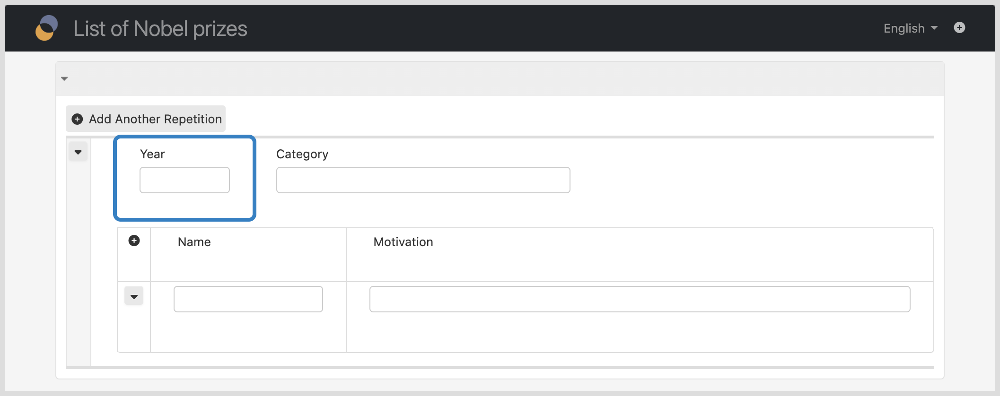
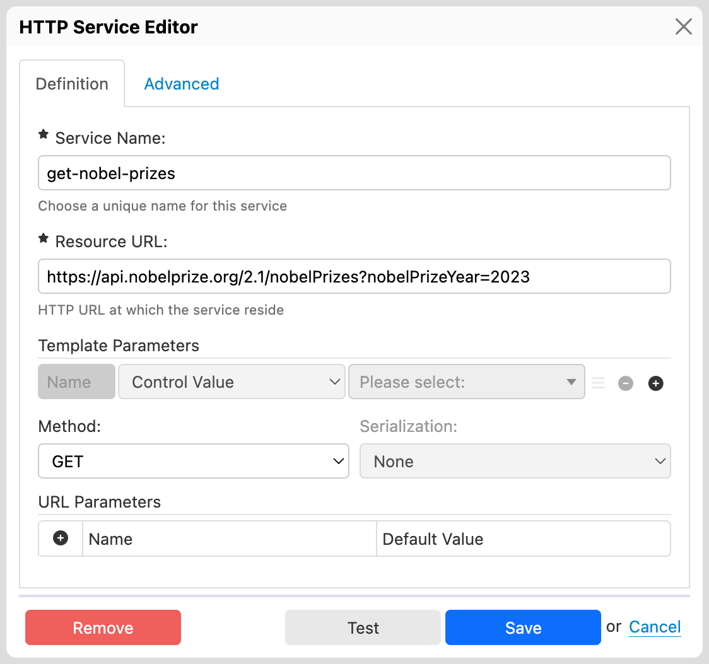
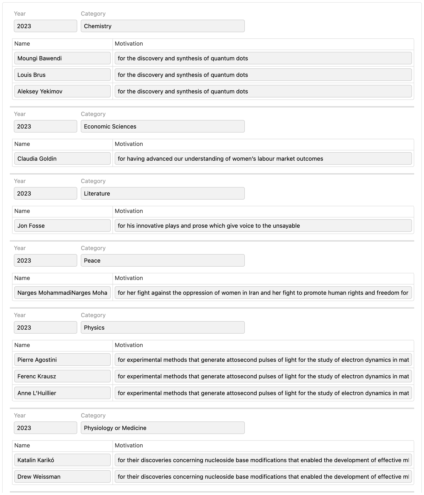

# Action syntax examples
  
## Overview

This document provides examples of the [Action syntax](actions-syntax.md) used to define actions in Form Builder.

## Example 1: List of Nobel Prize winners

The Nobel Prize organization exposes a [REST API](https://www.nobelprize.org/about/developer-zone-2/). We would like to create a form that queries that API to return the 2023 Nobel Prize winners, and show these details in a table.

To do this, we start by creating a simple form with a nested repetition:

- a repeated section for the Nobel Prizes
- a nested repeated grid for the laureates

Here is how the form looks like in Form Builder:



We then also create an HTTP Service endpoint:



It points to the following API endpoint:

```
https://api.nobelprize.org/2.1/nobelPrizes?nobelPrizeYear=2023
```

This returns data in JSON format (with `...` to indicate omitted parts):

```json
{
  "nobelPrizes": [
    {
      "awardYear": "2023",
      "category": {
        "en": "Chemistry",
        ...
      },
      ...,
      "laureates": [
        {
          "id": "1029",
          "knownName": {
            "en": "Moungi Bawendi"
          },
          ...,
          "motivation": {
            "en": "in recognition of the extraordinary services he has rendered by the discovery of the laws of chemical dynamics and osmotic pressure in solutions",
            ...
          }
        },
        ...
      ],
      ...
    }
  ],
  "meta": ...,
  "links": ...
}
```

Form Runner operates on an XML view of JSON data so that you can use XPath formulas. You can see it directly in the "XML Response Body" of the HTTP Service Editor. Here is what that view looks like:

```xml
<json type="object">
    <nobelPrizes type="array">
        <_ type="object">
            <awardYear>2023</awardYear>
            <category type="object">
                <en>Chemistry</en>
                ...
            </category>
            ...
            <laureates type="array">
                <_ type="object">
                    <id>1029</id>
                    <knownName type="object">
                        <en>Moungi Bawendi</en>
                    </knownName>
                    ...
                    <motivation type="object">
                        <en>for the discovery and synthesis of quantum dots</en>
                       ...
                    </motivation>
                    ...
                </_>
                ...
            </laureates>
        </_>
    </nobelPrizes>
    ...
    <meta type="object">
        ...
    </meta>
    <links type="object">
        ...
    </links>
</json>
```

Finally, we write, using the Form Builder's action syntax, an action that:

- runs upon form load
- calls the `get-nobel-prizes` service
- clears the `prizes` repeat
- iterates over the Nobel Prizes (`/*/nobelPrizes/_`), and for each entry
    - adds iterations to the `prizes` repeat
    - sets values in the controls `year` and `category` from the `awardYear` and `category/en` fields in the data
    - clears the `laureates` repeat
    - iterates over the laureates (`laureates/_`), and for each entry
        - adds iterations to the `laureates` repeat
        - sets values in the controls `known-name` and `motivation` from the `knownName` and `motivation/en` fields in the data

There is a nested iteration due to the nested repeats. here is what the complete listener and action look like:

```xml
<fr:listener version="2018.2" events="form-load-after-controls" actions="my-action"/>

<fr:action name="my-action" version="2018.2">
    <fr:service-call service="get-nobel-prizes"/>
    <fr:repeat-clear repeat="prizes"/>
    <fr:data-iterate ref="/*/nobelPrizes/_">
        <fr:repeat-add-iteration repeat="prizes" at="end"/>
        <fr:control-setvalue value="awardYear" control="year" at="end"/>
        <fr:control-setvalue value="category/en" control="category" at="end"/>
        <fr:repeat-clear repeat="laureates"/>
        <fr:data-iterate ref="laureates/_">
            <fr:repeat-add-iteration repeat="laureates"/>
            <fr:control-setvalue value="knownName" control="known-name" at="end"/>
            <fr:control-setvalue value="motivation/en" control="motivation" at="end"/>
        </fr:data-iterate>
    </fr:data-iterate>
</fr:action>
```

When you test or run the deployed form, you see the Nobel Prize winners for 2023:



## See also

- [Action syntax](actions-syntax.md)
- [Editing the source code of the form definition](edit-source.md)
- [Synchronizing repeated content](synchronize-repeated-content.md)
- [Actions](actions.md)
- [HTTP services](http-services.md)
- [Database services](database-services.md)
