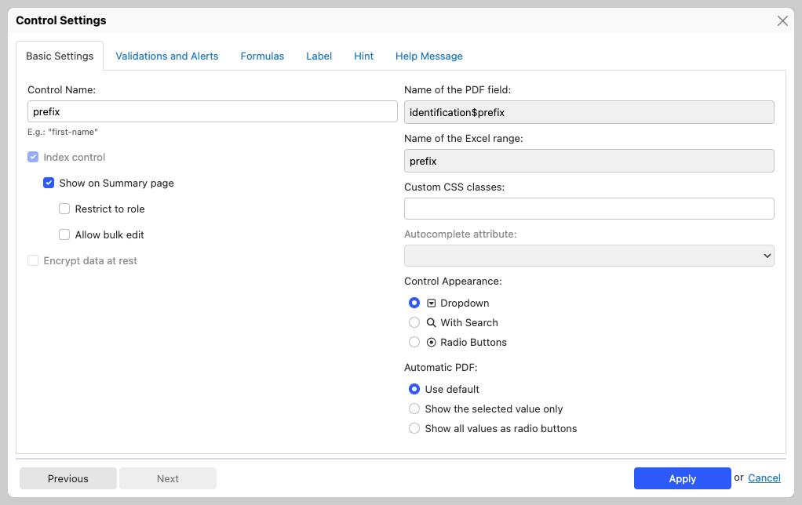
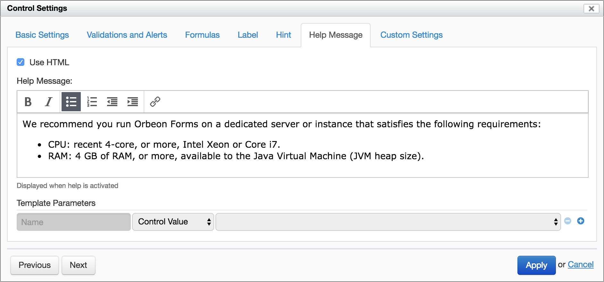

# Control settings

## Introduction

The Control Settings dialog allows controlling all the aspects the a control besides its label and hint. The dialog
has several tabs, detailed below.

### Basic Settings

#### Basic options

The control *name* specifies a identifier for the control, unique in the entire form (except [Section Templates](section-templates.md)). The
identifier is used for the following:

- to refer to the control value from formulas
- to determine the name when the form data is represented as XML

If no control name is explicitly specified, Form Builder assigns a default name, such as `control-42`.

The following options are available:

- __Show in Summary:__
    - When selected, the control value is visible as a Summary page column.
- __Show in Search:__
    - When selected, the control value is searchable in the Summary page.
- __Encrypt data at rest:__
    - SINCE Orbeon Forms 2018.1
    - This is an Orbeon Forms PE feature.
    - TODO
- __Email Recipient:__
    - When selected, the control is used to determine an email recipient ("To:") when the form data is sent by email.
    - If more than one non-blank email addresses is found, they are all included as email recipients. In addition, the `oxf.fr.email.to` property is used.
- __Email Carbon Copy Recipient:__
    - SINCE Orbeon Forms 2017.1
    - When selected, the control is used to determine a carbon copy email recipient ("Cc:") when the form data is sent by email.
    - If more than one non-blank email addresses is found, they are all included as email recipients. In addition, the `oxf.fr.email.cc` property is used.
- __Email Blind Carbon Copy Recipient:__
    - SINCE Orbeon Forms 2017.1
    - When selected, the control is used to determine a blind carbon copy email recipient ("Bcc:") when the form data is sent by email.
    - If more than one non-blank email addresses is found, they are all included as email recipients. In addition, the `oxf.fr.email.bcc` property is used.
- __Email Sender:__
    - SINCE Orbeon Forms 2017.1
    - When selected, the control is used to determine an email sender ("From:") when the form data is sent by email.
    - Only *one* "From:" email address is used, specifically the first non-blank address selected in the form. If no such address is found the `oxf.fr.email.from` property is used.
- __Exclude from Email Body:__
    - SINCE Orbeon Forms 2018.1
    - When using "All Control Values" in an [email body template](email-settings.md), controls selected with this checkbox will be
      *excluded* and omitted from the email body.
- __Include as Email Attachment__:
    - SINCE Orbeon Forms 2016.1
    - this option only shows for file and image attachments
    - when the property `oxf.fr.email.attach-files` is set to `selected`, only file and image attachments with this option checked are attached to the email
- __Show in Email Subject:__
    - DEPRECATED SINCE Orbeon Forms 2018.1: Use a [template for the subject](email-settings.md) instead.
    - When selected, the control value is used as part of the subject of the email when the form data is sent by email.
    - If more than one non-blank values are found, they are all included in the email subject, comma-separated.

The "Custom CSS Classes" field allows adding CSS classes which will be placed on the control in the resulting HTML. This can be used for custom styling.

#### Control appearance

[SINCE Orbeon Forms 4.10]

Some controls support more than one appearance. For example, a single selection control can appear as a dropdown menu,
or as radio buttons. When available, the "Control Appearance" selector allows selecting and changing the appearance of
the control.

See also [How the new Form Builder Appearance Selector Works](http://blog.orbeon.com/2015/06/how-new-form-builder-appearance.html).

#### Custom control settings

Some controls have custom settings. For example:

See also [Control metadata for the Control Settings dialog](metadata.md#control-metadata-for-the-control-settings-dialog)

### Validations and alerts

See [Form Builder Validation](validation.md) for details.

### Formulas

See [Formulas](formulas.md) for details.

### Label and Hint

[SINCE Orbeon Forms 2017.2]

In addition to setting a control's label and hint in place in the form area, you can also set and update them in this tab. You can switch between plain text and HTML text as well. The "Previous" and "Next" buttons allow quick navigation between controls.

### Help Message

This allows specifying some help text, which can be plain text or rich text when the "Use HTML" checkbox is selected.

The help message is available at runtime through a help icon positioned next to the control. By default, the icon opens a pop-up containing the help text. In *noscript* mode, the icon links to a help section at the bottom of the form.

The help text is localizable.

See also [Improving how we show help messages](http://blog.orbeon.com/2014/01/improving-how-we-show-help-messages.html).

### Dynamic labels, hints and help messages

[SINCE Orbeon Forms 2018.1]

Controls support *dynamic* labels, hints, and help messages. This means that, instead of being specified once and for all at form design time, labels, hints and help messages can incorporate dynamic parts such as control values and other custom expressions.

For more, see [Template syntax](template-syntax.md).

## See also

- [Control metadata for the Control Settings dialog](metadata.md#control-metadata-for-the-control-settings-dialog)
- [Form Builder Validation](validation.md)
- [Formulas](formulas.md)
- [Template syntax](template-syntax.md)
- Blog posts
    - [Enhanced validation in Form Builder and Form Runner](http://blog.orbeon.com/2013/07/enhanced-validation-in-form-builder-and.html)
    - [Improving how we show help messages](http://blog.orbeon.com/2014/01/improving-how-we-show-help-messages.html)
    - [How the new Form Builder Appearance Selector Works](http://blog.orbeon.com/2015/06/how-new-form-builder-appearance.html)
    - [Improved constraints on attachments uploads](http://blog.orbeon.com/2017/04/improved-constraints-on-attachments.html)
    - [More flexible email senders and recipients](http://blog.orbeon.com/2017/05/more-flexible-email-senders-and.html)
