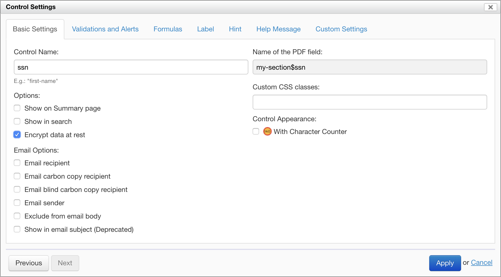

# Field-level encryption

## Availability

[SINCE Orbeon Forms PE 2018.2.2]

## Overview

This feature allows form authors to mark certain fields so any data entered by users in those fields is encrypted when stored in the database. This is typically useful for fields used to capture personal information, also referred to as "personally identifiable information" (PII), "sensitive personal information" (SPI), or "personal information," depending on the context. Encrypting such information can help you with compliance with privacy laws, such as GDPR.

## Marking fields for encryption

In Form Builder, to mark a field for encryption, open the "Control Settings" dialog for that field, and click on the "Encrypt data at rest" checkbox, as done in the screenshot below.

## Configuration

The key and algorithm to use is configured through the [encryption properties](../configuration/properties/general.md#encryption-properties). Before you start using this feature, make sure to change the default password.

## When encryption happens

When storing form data, encryption is done before it is sent to the implementation of persistence API. When retrieving form data, decryption is done after it is received from the implementation of the persistence API. This means that implementations of the persistence API don't need to worry about encrypting or decrypting data when storing or reading form data. Also, it means that values of fields marked for encryption will be encrypted on the wire on the way to and from your database, further increasing the security of your solution.

## Making changes to what needs to be encrypted

Say you edit an existing form definition in Form Builder and change the fields to be encrypted:

- If you publish the form as a new version, then changes apply to new data captured with the new version. (Existing data tied to earlier versions will continue to be encrypted per the earlier versions of those form definitions.)
- If you publish the form overwriting an existing version:
    - When retrieving form data form the persistence API, fields that were encrypted at the time the form data was stored will be decrypted (even if the list of fields to encrypt has changed in the current form definition).
    - When storing form data, fields marked for encryption in the form definition will be encrypted.

This means that, from the perspective of fields encryption, overwriting an existing form definition at publication time doesn't cause any problem. This is because encrypted fields are marked as such in the form data, so Orbeon Forms can decrypt them even if the list of fields to be encrypted has changed since the last time the form data was saved.

However, overwriting an existing form definition at publication time won't re-encrypt existing data. For this to happen, you need to [trigger a re-encryption](../form-runner/feature/home-page.md#re-encryption) from the Form Runner home page.

## Limitations

1. Currently, the search API isn't able to handle encrypted fields.
	- This has the following consequences:
		- You can't search values of encrypted fields, whether from a [summary page](summary-page.md) or using the [search API](../form-runner/apis/persistence-api/search.md).
		- Neither the summary page or the search API is able to show or return the values of encrypted fields (it will instead show/return the encrypted values).
	- Consequently, fields marked for encryptions shouldn't be marked to be shown on the summary page, or to show in search.
2. Re-encryption doesn't support changing the encryption key, that is decrypting with a first key (the old key) and encrypting with a second key (the new key). If you need to change the encryption key, for now you need to:
	1. For any published form, with encrypted fields, for which data exists, edit the form to unmark all encrypted fields, and re-publish the form overwriting the relevant version.
	2. From the Form Runner home page, trigger a re-encryption for all the forms that had encrypted fields.
	3. Change the key in your properties. After this, none of the fields in your form data will be encrypted in the database.
	4. Repeat step 1, but this time marking fields for encryption.
	5. Repeat step 2, after which the relevant fields will be encrypted with the new key.

We expect these limitations to be lifted in future versions of Orbeon Forms.

## See also 

- [Basic Settings](/form-builder/control-settings.md)
- [Re-encryption](/form-runner/features/home-page.md#re-encryption)
- [Encryption in the form data format](/form-runner/data-format/form-data.md#encryption)
