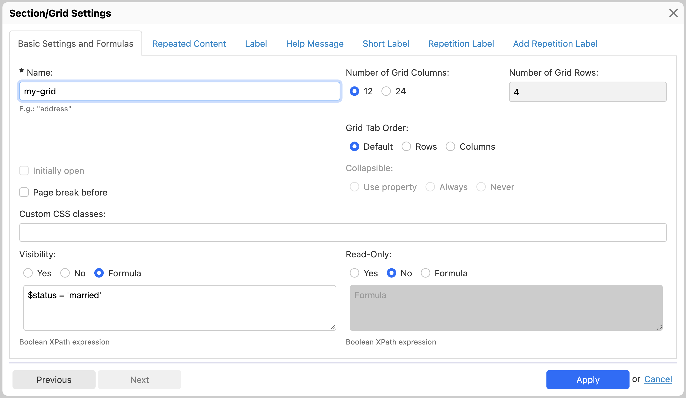

# Grid settings

## Settings shared with sections

See [Section and grid settings](container-settings.md).

## Basic settings

### Overview

### Number of Grid Columns

\[SINCE Orbeon Forms 2020.1\]

Orbeon Forms introduced a [12-column layout](/form-builder/form-area.md#the-12-column-layout) with Orbeon Forms 2017.2.

It is now possible to control whether an individual grid has 24 columns instead of 12. This is useful in particular when using a fluid form layout, which can be wider and accommodate more form controls on a given line. 

The default remains 12 columns. To change to 24 columns, choose the "24" option. The grid then allows moving cell boundaries on a 24-column resolution.

 

When going from 12 to 24 columns, the grid cells positions and widths are adjusted so that the grid looks the same. Similarly, when going from 24 to 12 columns, the grid cells positions and widths are adjusted so that the grid looks the same. However, if the grid contains controls whose position or width does not allow migrating the grid back to 12 columns, the "12" option is disabled.

### Number of Grid Rows

[SINCE Orbeon Forms 2021.1]

The dialog shows the current number of grid rows. This is the "static" number of grid rows, independently of the number of grid repetitions in the case of repeated grids.

See also [Enhancements to grids](https://blog.orbeon.com/2021/09/enhancements-to-repeated-grids.html).

### Grid Tab Order

[\[SINCE Orbeon Forms 2023.1\]](/release-notes/orbeon-forms-2023.1.md)

Cells inside a grid can be ordered in two ways:

- By row first, then by column
- By column first, then by row

Ordering the cells by row is the default behaviour.

Ordering the cells by column impacts the tab order (i.e. the order in which cells are navigated using the tab key) and the order in which the cells are placed on devices with a narrow display (e.g. phones) when all cells are stacked up (responsive layout).

A default value can be set for all grids in the [Form Settings dialog](/form-builder/form-settings.md#form-options).

See also the [blog post](https://blog.orbeon.com/2024/05/grid-tab-order).

## See also

- [Section and grid settings](container-settings.md)
- [Section settings](section-settings.md)
- [Repeat settings](repeat-settings.md)
- [Repeated grids](repeated-grids.md)
- [Formulas](formulas.md)
- [Section component](/form-runner/component/section.md)
- [Template syntax](template-syntax.md)
- [Wizard view](/form-runner/feature/wizard-view.md)
- Blog post: [Enhancements to grids](https://blog.orbeon.com/2021/09/enhancements-to-repeated-grids.html)
- Blog post: [Grid Tab Order](https://blog.orbeon.com/2024/05/grid-tab-order)