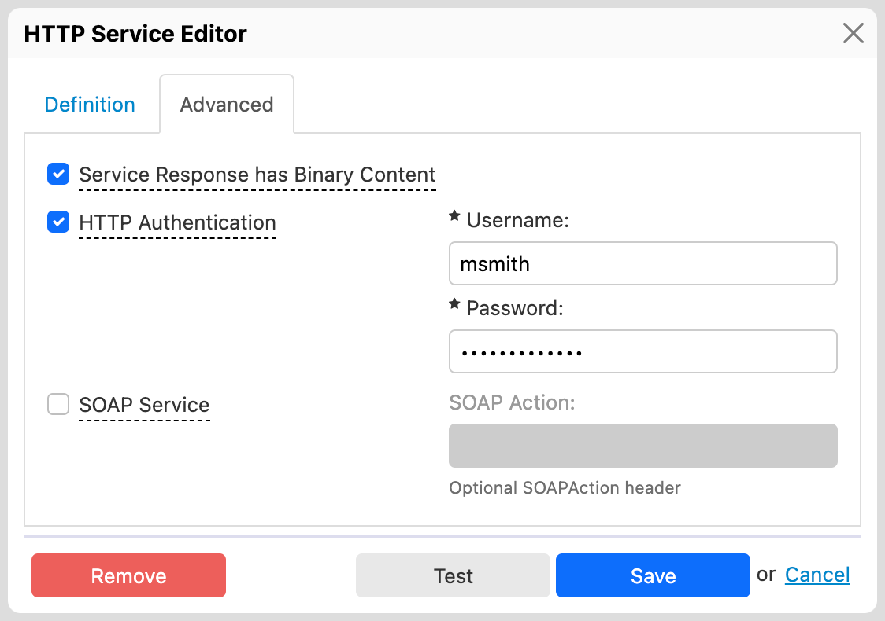
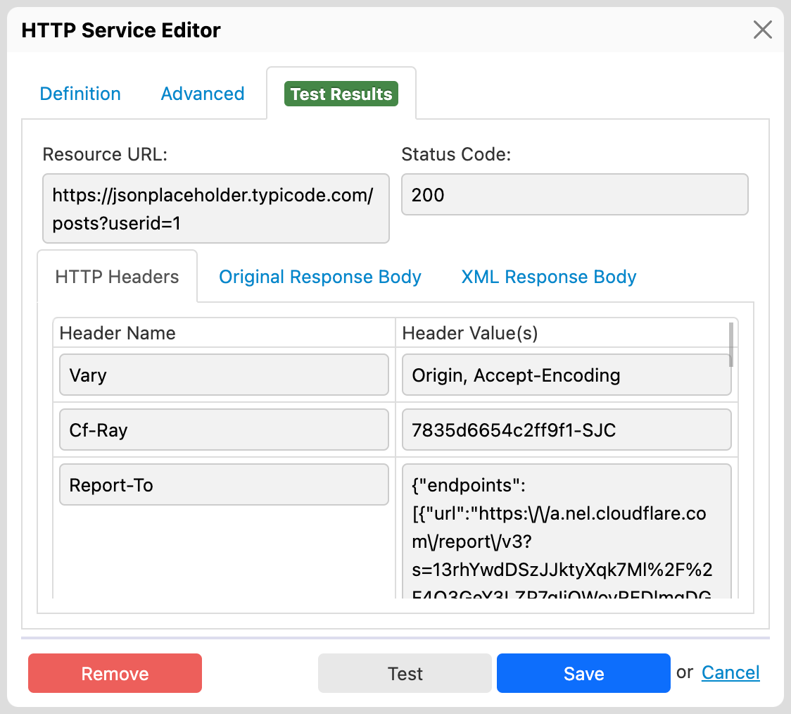
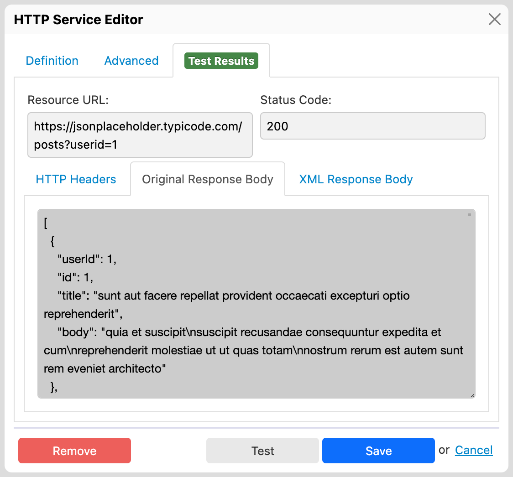
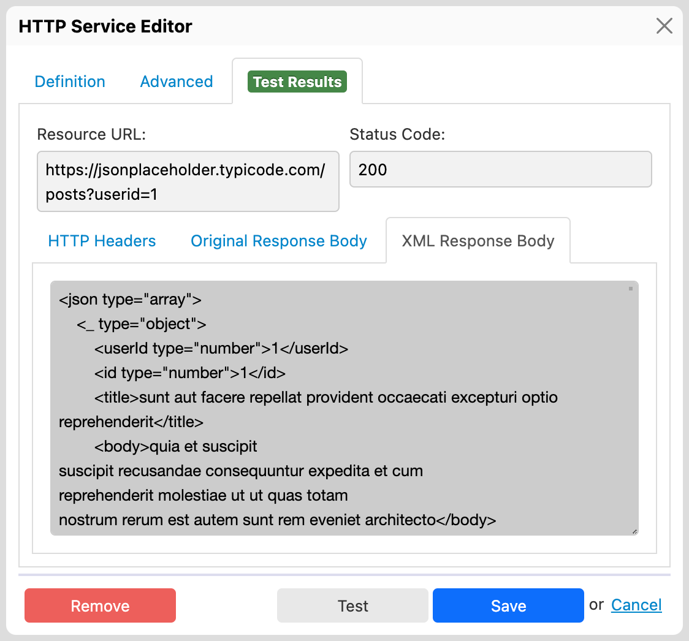

# HTTP services

## Introduction

The HTTP Service Editor allows you to create simple REST services. The idea is that a form can call a service, typically passing XML back and forth.

To create a new HTTP service, click the Add icon under "HTTP Services". The HTTP Service Editor opens.

The following screenshot shows an example of filled-out service:


## Service definition

### Basic settings

The "Definition" tab allows you to set the basic service parameters:

- **Service Name**
    - This is the name of the service, as seen by Form Builder. Must start with a letter, and may not contain spaces.
- **Resource URL**
    - `HTTP` or `HTTPS` URL to which the service must be called.
    - The value is an XPath Value Template, which means that the URL can be dynamic. For example, with Orbeon Forms 2018.1's `fr:control-string-value()` function:
      ```xpath
      https://example.org/{fr:control-string-value('control-1')}
      ```
- **Method**
    - The HTTP method to use: `GET`, `POST`, `PUT` or `DELETE`.
- **Serialization**
    - This applies to the `POST` and `PUT` methods.
    - **XML:** Sends the request body as XML (`application/xml`)
    - **HTML Form:** Sends the request body as HTML form data (`application/x-www-form-urlencoded`)
- **Request Body**
    - This applies to the `POST` and `PUT` methods.
    - The XML document to send to the service.

### URL parameters

\[SINCE Orbeon Forms 2016.1\]

- This applies to the `GET` and `DELETE` methods.
- You can add as many URL parameters as needed.
- A non-blank URL parameter specifies a default value for the parameter.
- An action can set the value of a parameter.

Here is [how to set URL parameters from an action](actions.md#passing-url-parameters-to-get-and-delete-methods).

### JSON support

\[SINCE Orbeon Forms 2016.1\]

A JSON *response* from a service is processed and converted to an XML document following the XForms 2.0 scheme (see [JSON support](../xforms/submission-json.md)).

See [#2480](https://github.com/orbeon/orbeon-forms/issues/2480) for details about sending JSON to services.

### URL Parameters before Orbeon Forms 2016.1

Prior to Orbeon Forms 2016.1, a "request body" is mandatory for the `GET` and `DELETE` methods. The body is not sent to the service, but instead is used to configure request parameters.

The content of the "Request Body" form has to be a well-formed XML document. The name of the root element doesn't matter, but usually `params`or `request` is used. Each child element defines a parameter as shown in the following example:

```xml
<params>
    <userId>1</userId>
    <userName>test</userName>
</params>
```
Here Orbeon invokes the URL:
```
$<Resource URL>?userId=1&userName=test
```
where `$<Resoure URL>` is the content of the input field "Resource URL".

Make sure to select `HTML Form` in the `Serialization` dropdown, otherwise the URL parameters are not appended to the request URL.

## Advanced parameters

The "Advanced" tab allows you to set advanced service parameters:

- **SOAP Service**
    - Whether this is a SOAP service
- **SOAP Action**
    - If selected, the value of the `SOAPAction` header.
- **HTTP Authentication**
    - Whether to use HTTP authentication.
    - **Username:** Username to use.
    - **Password:** Password to use.



## Testing a service

### Basics

The "Test" button allows you to test the service. Before doing this, you have to set data in the request body for a `POST` or `PUT` request, or you might want to set URL parameters for a `GET` or `DELETE`. Form Builder executes the service, and then provides information about the response returned, including:

- Whether an error occurred (green or red highlight)
- URL called
- Response status code
- Response headers
- Response body

This helps you troubleshoot the service call.





### XML view of JSON responses

[SINCE Orbeon Forms 2019.1]

When the service response is in JSON format, you can view the JSON response *translated into XML* following [XForms 2.0](https://www.w3.org/community/xformsusers/wiki/XForms_2.0#External_JSON_values).

This is useful when you want to use XPath expressions to access a JSON response, for example with [datasets](/form-runner/feature/datasets.md) or [item choices](actions.md#setting-the-choices-of-a-selection-control).

See also [JSON support](/xforms/submission-json.md).

 

## Saving the service

Once your service is defined, the "Save" buttons saves it to the form. You can come back to it and modify it later by clicking on the "Edit" icon next to the service name. You can also delete the service using the trashcan icon.

## Deleting a service

You can delete a saved service using the "Remove" button.

## See also

- [Actions](actions.md)
- [Database services](database-services.md)
- [Synchronizing repeated content](synchronize-repeated-content.md)
- [Datasets](/form-runner/feature/datasets.md)
- [JSON support](/xforms/submission-json.md)