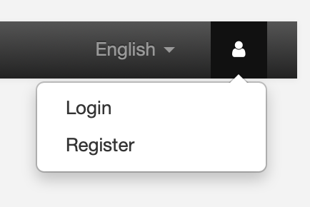
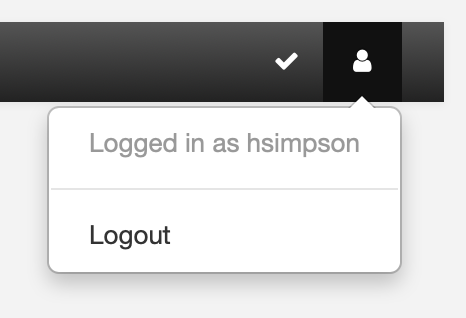

# Login & Logout

[SINCE Orbeon Forms 2018.2]

## Menu

Form Runner can show a *user menu* in the navigation bar, allowing users to login, logout, and, if necessary, register. You can enable the user menu by setting the following property to `true` (its default value is `false`):

```xml
<property
    as="xs:boolean"
    name="oxf.fr.authentication.user-menu.enable"
    value="true"/>
```

When enabled, before users login, the can contain 2 entries: "Login" and "Register", as shown in the screenshot below.



Conversely, when users are logged in, the menu will show who the user is, as well as provide a way for users to logout.



You can configure what page users will be taken to when they select "Login", "Logout", or "Register" by setting the properties below, shown here with their default value. Setting a property to the empty string disables hides the corresponding entry in the menu.

```xml
<property
    as="xs:string"
    name="oxf.fr.authentication.user-menu.uri.login"
    value="/fr/auth?source={xxf:get-request-path()}"/>
    
<property as="xs:string"
    name="oxf.fr.authentication.user-menu.uri.logout"
    value="/fr/logout"/>
    
<property as="xs:string"  
    name="oxf.fr.authentication.user-menu.uri.register"
    value=""/>
```

*NOTE: Orbeon Forms does not provide an out of the box system to create and manage users. The `register` menu is intended instead to link to your existing user management system.*

## See also

- [Setup users for access control](users.md) - How to setup Orbeon Forms so that users and roles are provided.
- [Access control for deployed forms](deployed-forms.md) - How to control access to deployed forms.
- [Form fields](form-fields.md) - How to control access to specific form fields based on the user user's roles.
- [Access control for editing forms](editing-forms.md) - How to control access to Form Builder.
    - [Owner and group member permissions](owner-group.md) - Access based on ownership and groups.
    - [Organization-based permissions](organization.md) – Access based on organizational structure.
- [Scenarios](scenarios.md)
