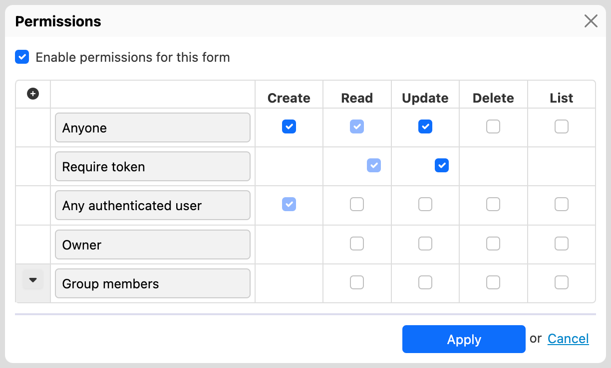
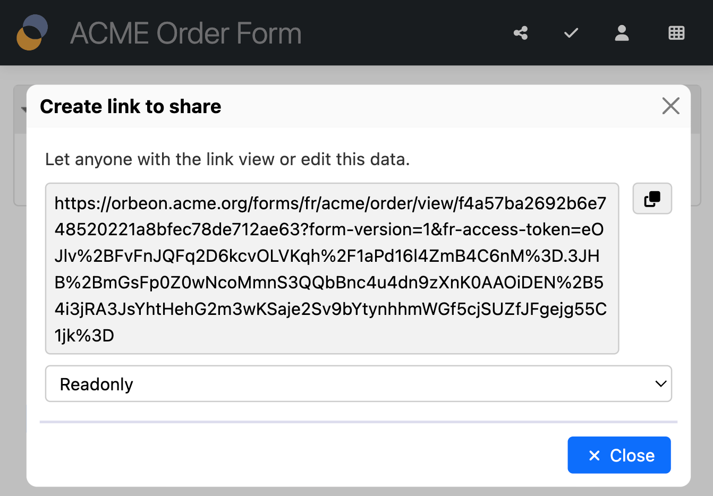

# Token-based permissions

## Availability

[\[SINCE Orbeon Forms 2023.1\]](/release-notes/orbeon-forms-2023.1.md)

This is an Orbeon Forms PE feature.

## Overview

This feature allows you to specify that a user can access form data with readonly or read-write permissions, provided that they are provided a link containing a permission token.

## Configuration

### Permissions

This feature is not enabled by default. To enable it for a given form, you must set form permissions that include at least one "Require token" permission ("Read" or "Update"), either from Form Builder or using global permission configuration properties.



Here is an example of configuration property:

```xml
<property as="xs:string"  name="oxf.fr.permissions.acme.*">
    {
      "anyone":            [ "create" ],
      "anyone-with-token": [ "read", "update" ],
      "roles": {
        "orbeon-admin":    [ "read", "update", "delete", "list" ]
      }
    }
</property>
```

### Password and validity

In addition, a password must be configured for token encryption in your `properties-local.xml`. This is done with the `oxf.fr.access-token.password` property:

```xml
<property
    as="xs:string"
    name="oxf.fr.access-token.password"
    value="CHANGE THIS PASSWORD"/>
```

Finally, you must also set a token validity duration. This is expressed in minutes with the `oxf.fr.access-token.validity` property:

```xml
<property 
    as="xs:integer"
    name="oxf.fr.access-token.validity.*.*"
    value="60"/>
```

For security reasons, by default the validity is set to 0 and tokens will be generated, but they will expire immediately, making them unusable.

You must change the default password or Form Runner will generate an error when attempting to use the password. You must also change it to a strong enough password if password strength checks are enabled, see [`oxf.crypto.check-password-strength`](/configuration/properties/general.md#oxf.crypto.check-password-strength).

### Links

#### General

Links use the `oxf.fr.external-base-url` to specify the external based URL to use: 

```xml
<property 
    as="xs:string"
    name="oxf.fr.external-base-url"
    value="https://orbeon.acme.org/forms"/>
```

See also [Template syntax - Links](/form-builder/template-syntax.md#links).

You generate a link containing a token in one of two ways, described below.

#### Using templates

When using a [template](/form-builder/template-syntax.md#links) (for an Explanation control, label, email, or other), you can choose the "Generate token URL parameter" for "View page" or "Edit page" links.


#### Using the Share dialog

When enabled with the `oxf.fr.navbar.share-button.enable` property, you can use the "Share" icon in the Form Runner navbar. This opens a dialog allowing you to configure and share a link with a token.  

```xml
<property
    as="xs:boolean"
    name="oxf.fr.navbar.share-button.enable.*.*"
    value="true"/>
```



The dialog allows the user to decide whether to share a readonly link or a read-write link (if the user itself has the "Update" permission). The link can simply be copied with the "Copy link" icon button.

## Token revocation

If you believe that tokens have been compromised, or if you simply want to make sure there are no outstanding tokens, you can immediately expire all tokens by changing the `oxf.fr.access-token.password` property. This will cause all incoming tokens to be considered invalid.

## See also 

- [Setup users for access control](users.md) - How to setup Orbeon Forms so that users and roles are provided.
- [Login & Logout](login-logout.md) - Optional user menu for providing links to login and logout functions.
- [Access control for deployed forms](deployed-forms.md) - How to control access to deployed forms.
- [Form fields](form-fields.md) - How to control access to specific form fields based on the user's roles.
- [Access control for editing forms](editing-forms.md) - How to control access to Form Builder.
    - [Owner and group member permissions](owner-group.md) - Access based on ownership and groups.
    - [Organization-based permissions](organization.md) – Access based on organizational structure.
- [Scenarios](scenarios.md)
- [Template syntax](/form-builder/template-syntax.md)