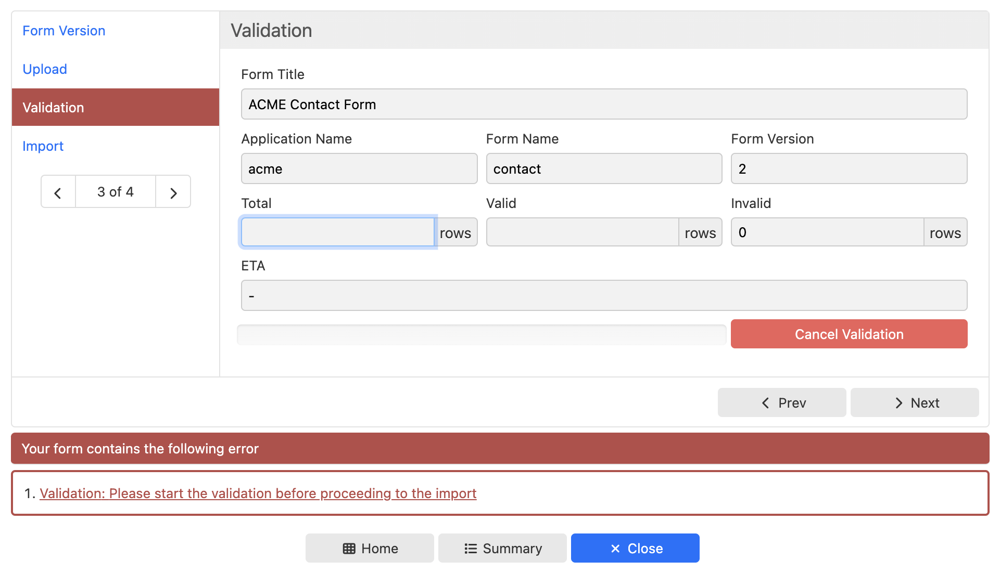
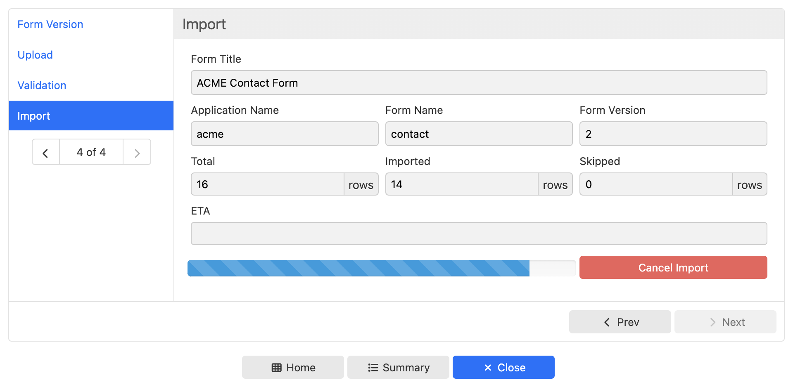

# Excel Import

## Availability

This is an Orbeon Forms PE feature.

## What it is

This feature allows you to import batches of data from a source Excel spreadsheet to a deployed Form Runner form.

## How it works

In order to import an Excel file, you follow a process in the Excel Import page as described below.

_NOTE: Until Orbeon Forms 2018.1 the import wizard looked a little bit different from the screenshots below, but the steps are the same except for the selection of the form definition version._

### Access the Excel Import page 

You start the import from the Form Runner Import page, accessible from the Summary page.


### Select the form version

[SINCE Orbeon Forms 2018.2]

If form definition versioning is supported, you select the form definition version. The dropdown menu shows all published versions for the given form name and application name.

Selecting a version shows the versioning comment, if any, associated with the version, as well as the number of data records available in the database for that version.
    


### Upload the file

You navigate to the Upload section and select the Excel 2007 file to upload and import.


### Validate the data
    
You navigate to the Validation section. From there, you can start data validation.


    
Validation takes place and gives you an indication of the progress.


    


### Import the data
    
Once validation is terminated, you navigate to the Import section. From there, you can start the data import. You ahve the option to add to existing data for the given form, or remove all existing data first.


    
Import takes place and gives you an indication of the progress.


    


_NOTE: Only the Excel 2007 `.xlsx` format (Office Open XML) is supported. The older, `.xls` format is not supported._

## Enabling the import button

You enable the import button on the Summary page by adding the import token to the `oxf.fr.summary.buttons.*.*` property. Here for the Orbeon Contact form:

```xml
<property as="xs:string" name="oxf.fr.summary.buttons.orbeon.contact">
    home review pdf delete duplicate import new
</property>
```

## Mapping between form controls and spreadsheet

A given Excel file contains data for a single Orbeon Forms form.

The spreadsheet must follow this format:

- only the first sheet is considered
- the first row is a special header row, where each cell contains an identifier that matches a control name in the given form
- each subsequent row contains data for a new instance of form data

In your form, you create controls with names that match the names in the first row (header row) of the Excel document.

Here is an example spreadsheet for the sample Orbeon Contact form:


_NOTE: Only characters allowed in XML names are allowed as control names in Form Builder. In case your Excel header row requires names with non-XML characters (Form Builder will tell you the name is not allowed), simply replace them by "_" in Form Builder._

## Allowing invalid data

[SINCE Orbeon Forms 2017.2]

By default, invalid data is skipped during import.

You can enable the optional import of invalid data with the following property:

```xml
<property
    as="xs:boolean"
    name="oxf.fr.import.allow-invalid-documents.*.*"
    value="true"/>
``` 

By default, it is set to `false` and the user is not provided with an option to skip invalid data.

When set to `true`, the user is provided with an option to skip invalid data at the time of import:


## Handling dates and times

[SINCE Orbeon Forms 2019.2]

Cells that contain values formatted as date/time, date, or time in the Excel spreadsheet are automatically converted to their respective ISO formats before being stored as form data. 

## Restricting to the latest version

[SINCE Orbeon Forms 2018.2]

With Orbeon Forms 2018.2, you can select which form definition version to import to.

You can disable the ability for the user doing the import to select a version and always automatically select the latest form definition version with the following property:

```xml
<property
    as="xs:boolean"
    name="oxf.fr.import.restrict-to-latest-version.*.*"
    value="true"/>
``` 

## Limitations

The import functionality does not support importing data into repeated grids.

## See also

- [Excel named ranges import and export](excel-import-export.md)
- [Service calls](/form-runner/link-embed/linking.md)