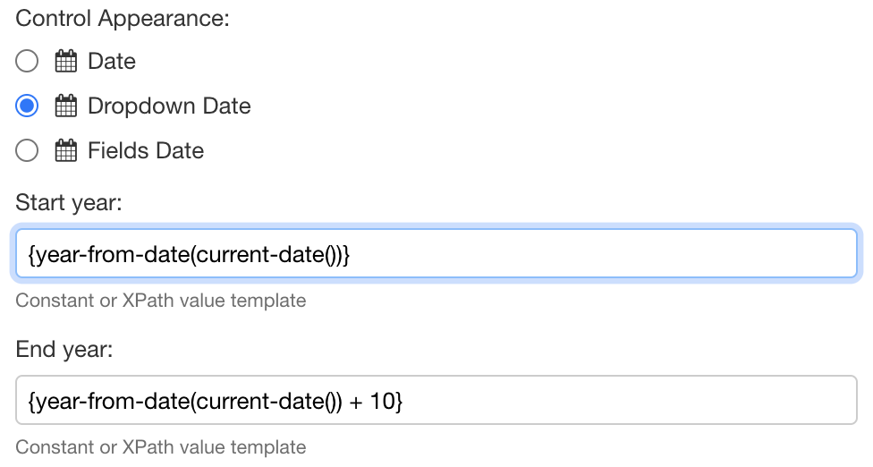

# Dropdown Date Component

## What it does

This component allows users to select a date with 3 drop-downs, for the month, day, and year.


## Default

By default, the years show from 1970 to the current year.

## Configuration

### From Orbeon Forms 2020.1

The values for the start and end year are determined as with the [`fr:component-param-value()`](/xforms/xpath/extension-form-runner.md#fr-component-param-value) function, in the following order:

1. `start-year` and `end-year` attributes on the control
2. Form-level settings (in the `fr-form-metadata` instance)
3. `oxf.xforms.xbl.fr.dropdown-date.start-year.*.*` property with app/form wildcards
4. `oxf.xforms.xbl.fr.dropdown-date.start-year` property

All values are evaluated as AVTs.

For backward compatibility, a value can be an XPath expression, as follows:
 
- The value is evaluated as an AVT. If the result is castable as an integer, the value is used as an integer.
- The value is evaluated as an XPath expression.

Starting Orbeon Forms 2020.1, dynamic values should be written as AVTs and not plain XPath expressions.

Form Builder offers an option in the "Control Settings" dialog. The following example shows how to set the first available year as the current year, and the last available year as 10 years from the current year.



### Until Orbeon Forms 2019.2

The values for the start and end year are determined as follows:

1. [SINCE 2016.3] If you're on Orbeon Forms 2016.3 or newer, and your form was created with Form Builder, and you defined an app/form specific property as in the example below, then the values of these properties are used.

    ```xml
    <property 
       as="xs:string" 
       name="oxf.xforms.xbl.fr.dropdown-date.start-year.*.*" 
       value="2010"/>
    <property 
       as="xs:string" 
       name="oxf.xforms.xbl.fr.dropdown-date.end-year.*.*"
       value="year-from-date(current-date()) + 10"/>
    ```
2. [SINCE 4.2] If the conditions in point 1 don't apply, but you're on Orbeon Forms 4.2 or newer, and you defined a global property setting the start or end date, as in the example below, then the value of this property is used.

    ```xml
    <property 
       as="xs:string"
       name="oxf.xforms.xbl.fr.dropdown-date.start-year"
       value="1970"/>
    <property 
       as="xs:string"
       name="oxf.xforms.xbl.fr.dropdown-date.end-year"
       value="year-from-date(current-date())"/>
    ```
3. Finally, if none of the properties mentioned in points 1 and 2 above are usable, the start year is set to 1970, and the end year to the current year.

The values of all the properties mentioned earlier are XPath expressions. In particular, this allows you to set an end year which isn't hard coded and instead allows you to set it to, say, "this year".
