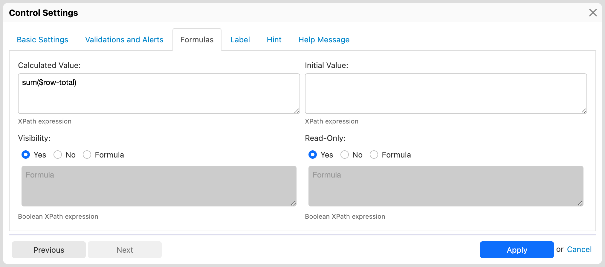

# Automatic calculations dependencies

## Rationale

Calculated and initial values expressed with formulas can depend on the value of other form controls. In turn, those form controls can be calculated from yet other form controls. Such controls may appear further down in the form, or, in fact, in any place.

It is therefore important to compute calculated and initial values in an order based on the *dependencies* of that value, not just in the order in which the controls appear in the form. This is very similar to what happens in a spreadsheet.

## Availability

[SINCE Orbeon Forms 4.10]

Form Runner supports dependencies of calculated and initial values when the associated formulas refer to other controls via *variables* (such as `$units`, where `units` is the *name* of a control on the form).

This is done by adding the `xxf:analysis.calculate="true"` attribute on the first model of the form, via the "Edit Source" feature as there was no user interface for this settings yet.

[SINCE Orbeon Forms 2018.1]

Orbeon Forms add an user interface option to enable and disable automatic calculations dependencies in the "Form Settings" dialog.

In addition, for new form definitions, the "Automatic Calculations Dependencies" option is enabled by default starting with Orbeon Forms 2018.1.

_NOTE: Existing form definitions which do not have the `xxf:analysis.calculate="true"` attribute set in the form definition source are not automatically upgraded to enable automatic calculations dependencies. You must enable dependencies explicitly in the "Form Settings" dialog._


## Renaming of controls and formulas

[SINCE Orbeon Forms 2019.1]

When a control or section or grid is renamed, dependent formulas which use the variable notation `$foo` where `foo` is the control name, are automatically updated.

## Examples

Consider the following grid, where the totals must appear, on one hand, on each line item row, but where the global totals are present *before* the grid.


Row totals are expressed with the following calculated value formula:

```xpath
$units * $unit-price
```


And the global totals with the following calculated value formula:

```xpath
sum($units)
```

and:

```xpath
sum($row-total)
```



Automatic calculations dependencies ensure that, even if the totals show in the form before the grid, their values update correctly as the user modifies the "Units" and "Unit Price" fields.

_NOTE: It is important to note that using *variable* is key for the dependencies to work. Using other expressions referring to form data, such as `/form/my-section/my-control`, or `//my-control`, will not work for the purpose of dependencies._

## See also 

- Blog post: [Automatic calculation dependencies](https://blog.orbeon.com/2018/10/automatic-calculation-dependencies.html)
- [Formulas](../../form-builder/formulas.md)
- [Control settings](../../form-builder/control-settings.md)
