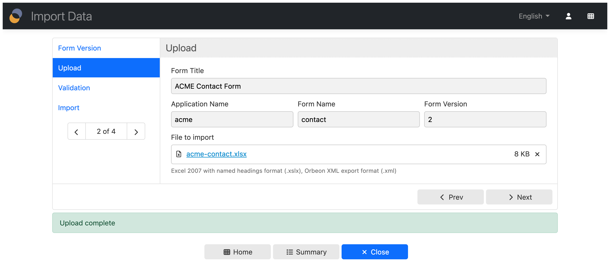
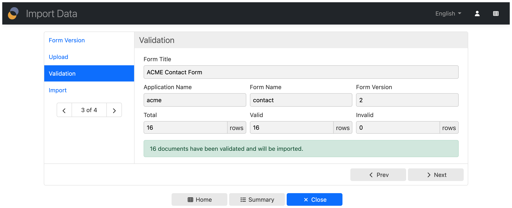
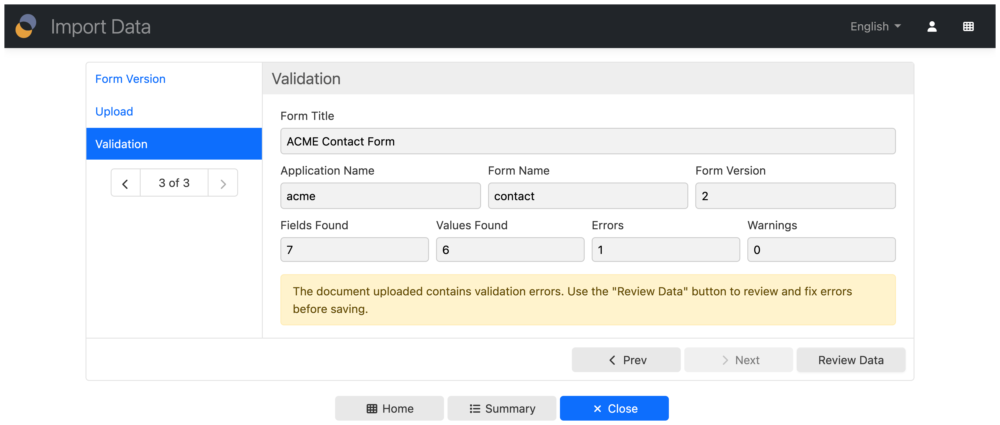
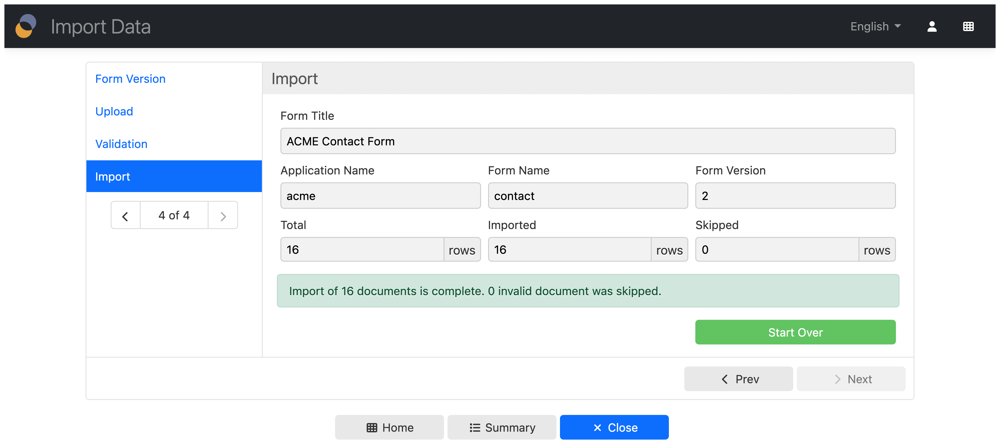
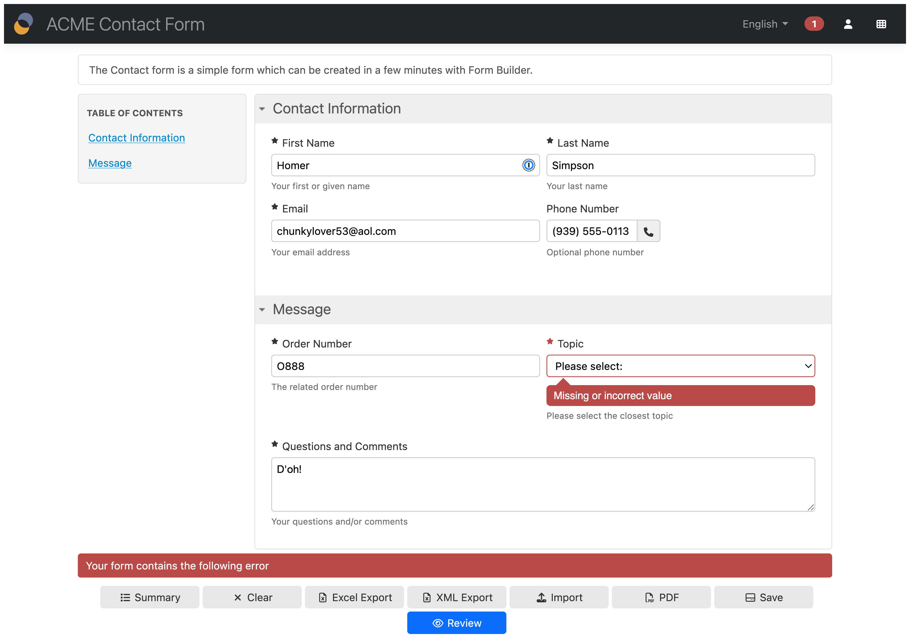

# Excel and XML Import

## Availability

This is an Orbeon Forms PE feature.

## What it is

This feature allows you to import data from a source Excel document or XML document.

[\[SINCE Orbeon Forms 2021.1\]](/release-notes/orbeon-forms-2021.1.md)

A new Excel named ranges-based format is supported. Here are the main differences between the two types of Excel imports:

| "Headings" format                          | "Named ranges" format       |
|--------------------------------------------|-----------------------------|
| multiple form documents at a time (batch)  | one form document at a time |
| row and column-based                       | named range based           |
| no repeat support                          | repeat support              |
| fixed layout                               | customizable layout         |

The Named ranges format does not replace the Headings format but complements it.

[\[SINCE Orbeon Forms 2021.1\]](/release-notes/orbeon-forms-2021.1.md)

A new XML format is supported.

[//]: # (TODO)

## Allowed import formats

[\[SINCE Orbeon Forms 2021.1\]](/release-notes/orbeon-forms-2021.1.md)

You can configure the Import page to support various import formats. These include:

- `excel-headings`: The default Excel import format, where the first row of the Excel file contains the names of the form fields.
- `excel-named-ranges`: The Excel import format where the Excel file uses named ranges to map to form fields.
- `xml-form-structure-and-data`: The XML format where the XML file contains both the form structure and data.

The `excel-headings` format is enabled by default. It is exclusive with the `excel-named-ranges` format, which means that you can use none, or one of these tokens, but not both at the same time.

The default configuration is:

```xml
<property
    as="xs:string"
    name="oxf.fr.import.allowed-formats.*.*" 
    value="excel-headings xml-form-structure-and-data"/>
```

Here is an example of configuration which switches to the `excel-named-ranges` format:

```xml
<property
    as="xs:string"
    name="oxf.fr.import.allowed-formats.*.*" 
    value="excel-named-ranges xml-form-structure-and-data"/>
```

## Import wizard steps

In order to import an Excel file, you follow a process in the Excel Import page as described below.

### Access the Excel Import page 

You start the import from the Form Runner Import page, accessible from the [Summary page](/form-runner/feature/summary-page.md) when the "Import" button is configured, or directly with the path:

```
/fr/import/$app/$form
```


You enable the "Import" button on the [Summary page](/form-runner/feature/summary-page.md) by adding the `import` token to the `oxf.fr.summary.buttons.*.*` property. Here for the ACME Contact form:

```xml
<property as="xs:string" name="oxf.fr.summary.buttons.acme.contact">
    home review pdf delete duplicate import new
</property>
```

### Select the form version

[SINCE Orbeon Forms 2018.2]

If form definition versioning is supported, and if the given form definition has more than one version, you can select the form definition version. The dropdown menu shows all published versions for the given form name and application name.

Selecting a version shows the versioning comment, if any, associated with the version, as well as the number of data records available in the database for that version.
    


### Upload the file

You navigate to the Upload section and select the Excel 2007 file to upload and import.



### Validate the data
    
You navigate to the Validation section. From there, data validation starts automatically, giving you an indication of the progress.


    


With the `excel-named-ranges` and `xml-form-structure-and-data` formats, information about valid and invalid fields shows.



### Import the data

*NOTE: This step only applies to the `excel-headings` format.*
    
Once validation is terminated, you navigate to the Import section. From there, you can start the data import. When using the Headings format, you have the option to add to existing data for the given form, or remove all existing data first.


    
Import takes place and gives you an indication of the progress.


    


_NOTE: Only the Excel 2007 `.xlsx` format (Office Open XML) is supported. The older, `.xls` format is not supported._

### Review the data

*NOTE: This step only applies to the `excel-named-ranges` and `xml-form-structure-and-data` formats.*

Before the data is saved to the database, you can review errors if any and decide to correct them or to perform a new import.



[//]: # (![]&#40;../images/excel-import-review.png&#41;)

## Form controls mapping

### Excel Headings format

#### Excel file format

A given Excel file contains data for a single Orbeon Forms form.

The spreadsheet must follow this format:

- only the first sheet is considered
- the first row is a special header row, where each cell contains an identifier that matches a control name in the given form
- each subsequent row contains data for a new instance of form data

In your form, you create controls with names that match the names in the first row (header row) of the Excel document.

Here is an example spreadsheet for the sample Orbeon Contact form:


[//]: # (TODO: clarify)

_NOTE: Only characters allowed in XML names are allowed as control names in Form Builder. In case your Excel header row requires names with non-XML characters (Form Builder will tell you the name is not allowed), simply replace them by "_" in Form Builder._

#### Limitations

The import functionality with the `excel-headings` format does not support importing data into repeated grids.

### Excel Named ranges format

For more about the format, see [Excel and XML Export](/form-runner/feature/excel-xml-export.md).

You don’t have to export a form to Excel to import data: as long as you have a spreadsheet that includes the appropriate named ranges (see above), you can use it for importing. This means that you can reuse existing spreadsheets with a few additions, and keep a spreadsheet layout that users are familiar with.

## Handling dates and times

[SINCE Orbeon Forms 2019.2]

Cells that contain values formatted as date/time, date, or time in the Excel spreadsheet are automatically converted to their respective ISO formats before being stored as form data.

## Other configurations

### Allowing invalid data

[SINCE Orbeon Forms 2017.2]

*NOTE: This property only applies to the `excel-headings` format.*

By default, invalid data rows are skipped during import.

You can enable the optional import of invalid data with the following property:

```xml
<property
    as="xs:boolean"
    name="oxf.fr.import.allow-invalid-documents.*.*"
    value="true"/>
``` 

By default, it is set to `false` and the user is not provided with an option to skip invalid data.

When set to `true`, the user is provided with an option to skip invalid data at the time of import:


### Restricting to the latest version

[SINCE Orbeon Forms 2018.2]

The user can select which form definition version to import to.

You can disable the ability for the user to do so, and always automatically select the latest form definition version, with the following property:

```xml
<property
    as="xs:boolean"
    name="oxf.fr.import.restrict-to-latest-version.*.*"
    value="true"/>
``` 

### Start Over button

[\[SINCE Orbeon Forms 2020.1\]](/release-notes/orbeon-forms-2020.1.md)

By default, the "Start Over" button is not shown on the Import page. You can enable it with the following property:

```xml
<property 
    as="xs:boolean"
    name="oxf.fr.import.show-start-over-button.*.*"
    value="true"/>
```

### Showing the application and form names

[\[SINCE Orbeon Forms 2021.1\]](/release-notes/orbeon-forms-2021.1.md)

By default, the import page shows the application and form names. You can hide them with the following property:

```xml
<property 
    as="xs:boolean"
    name="oxf.fr.import.show-app-form-names.*.*"
    value="false"/>
```

### Forwarding parameters to the data review page

[\[SINCE Orbeon Forms 2021.1\]](/release-notes/orbeon-forms-2021.1.md)

*NOTE: This property only applies to the `excel-named-ranges` and `xml-form-structure-and-data` formats.*

This property allows you to forward specific URL parameters that were passed to the Import page to the data review page. By default, no parameters are forwarded. This example shows how to forward the `foo` and `bar` parameters:

```xml
<property 
    as="xs:string"
    name="oxf.fr.import.forward-parameters.*.*"
    value="foo bar"/>
```

### Passing a document id to the data review page

[\[SINCE Orbeon Forms 2021.1\]](/release-notes/orbeon-forms-2021.1.md)

*NOTE: This property only applies to the `excel-named-ranges` and `xml-form-structure-and-data` formats.*

You can pass a document id to the import page. This is useful if you want to propagate a document id to data review page to update or merge with an existing document in the database. This example shows how to pass the `document-id` parameter:

```
/fr/import/orbeon/contact?document-id=123
```

### Customizing the buttons in the buttons bar

[\[SINCE Orbeon Forms 2021.1\]](/release-notes/orbeon-forms-2021.1.md)

This property allows you to configure the buttons at the bottom of the Import page. They are, by default:

```xml
<property 
    as="xs:string"
    name="oxf.fr.import.buttons.*.*"
    value="home summary close"/>
```

If, for example you don't want the `summary` button, then set the property to:

```xml
<property 
    as="xs:string"
    name="oxf.fr.import.buttons.*.*"
    value="home close"/>
```

## See also

- [Excel and XML Export](/form-runner/feature/excel-xml-export.md)
- [Form definitions and form data batch export](/form-runner/feature/exporting-form-definitions-and-form-data.md)
- [Service calls](/form-runner/link-embed/linking.md)

[//]: # (https://3.basecamp.com/3600924/buckets/16915667/messages/4541166737)
[//]: # ()
[//]: # (<!-- Mais ne le montrer qu'en mode `edit` -->)
[//]: # (<property )
[//]: # (    as="xs:string"  )
[//]: # (    name="oxf.fr.detail.button.import.visible.acme.contact")
[//]: # (    value="fr:mode&#40;&#41; = 'edit'"/>)
[//]: # ()
[//]: # (<!-- Le bouton `import` navigue à la page d'import en passant le `document-id` -->)
[//]: # (<property as="xs:string" name="oxf.fr.detail.process.import.acme.contact">)
[//]: # (    require-uploads)
[//]: # (    then navigate&#40;'/fr/{fr:app-name&#40;&#41;}/{fr:form-name&#40;&#41;}/import?document-id={fr:document-id&#40;&#41;}'&#41;)
[//]: # (</pro