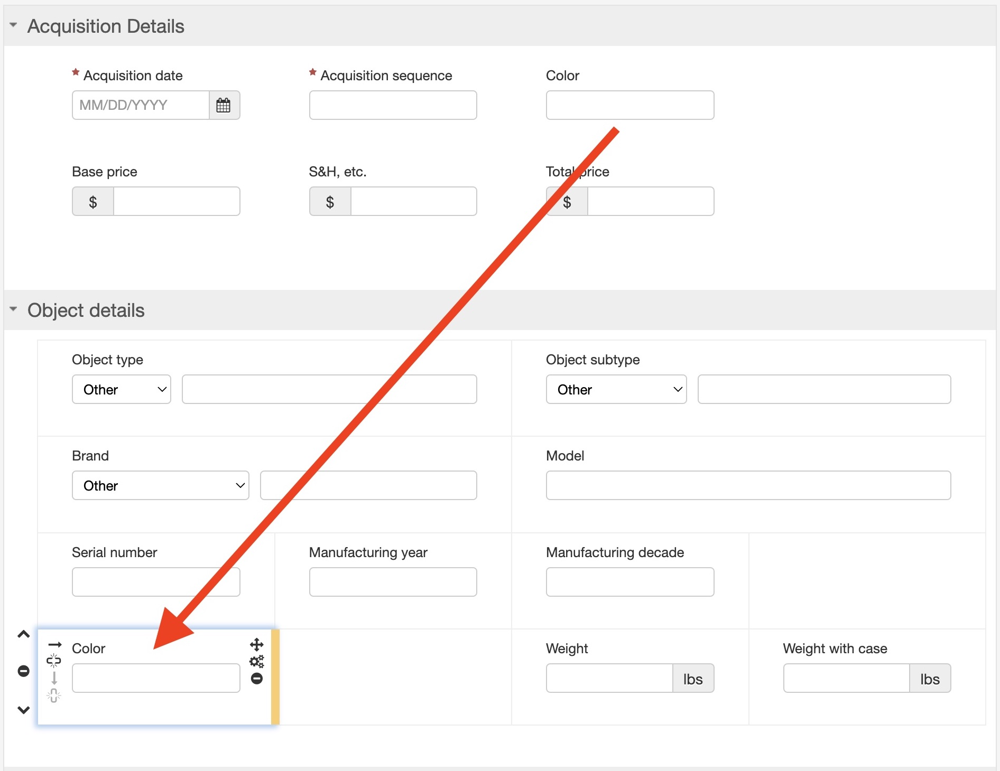

# Simple data migration

## Availability

This feature is available since Orbeon Forms 2018.2.

This is an Orbeon Forms PE feature.

## Rationale

Simple data migration is an option which sits between "overwrite an existing form definition in an incompatible way" and "create a whole new form definition version". When enabled, simple data migration allows you to overwrite a form definition version, but keep more changes data-compatible than simply changing control labels, etc. (as described in [Versioning](versioning.md)), namely, the updated form definition can:

- add and remove controls
- add and remove grids and sections

When you load existing data with the updated form definition, the following happens:

- If the data is *missing* placeholders for data associated with new controls, grids or sections, those are automatically added.
- If the data has *extra* placeholders for data associated with removed controls, grids or sections, those are automatically removed. 

## Configuration

This option is disabled by default. You can enable it in the Form Settings's Form Options tab:

- __Use property:__ Use the value set by the `oxf.fr.detail.data-migration` property.
- __Enabled:__ Perform simple data migration when loading and receiving data.
- __Disabled:__ Do not perform simple data migration when loading and receiving data.
- __Raise an error:__ If the data is incompatible upon load, raise an error. The user will not be able to access the data.

The `oxf.fr.detail.data-migration` is set as follows by default:

```xml
<property
    as="xs:string"
    name="oxf.fr.detail.data-migration.*.*"
    value="disabled"/>
```

The possible tokens are:

- __Enabled:__ `enabled`
- __Disabled:__ `disabled`
- __Raise an error:__ `error`


## Moving controls

[SINCE Orbeon Forms 2022.1]

With this enhancement, the updated form definition can now move (without renaming) form controls as long as they remain within the same nesting of repeated content. For example:

- Move controls at the top-level of a form, even across grids and sections.
- Move controls within a given level of repeated grids or repeated sections, even across nested grids.

Simply moving a form control this way allows you to reorganize your form while keeping access to existing data.



When you load existing data with the updated form definition, the following happens:

- If the data is both *missing* a placeholder and has an *extra* placeholder with the same name, and the placeholder doesn't cross repeated grids or section boundaries, then Form Runner considers that the form control moved and automatically moves the data that was read from the database. 

## Limitations

The following operations in particular are not supported:

- __Renaming form controls:__ This means changing the form, grid, or section name within settings.
- __Moving form controls across repeated grids or section boundaries:__ The reason is that it would be unclear how to handle data where fields were repeated and no longer are, and vice versa.

## See also

- [Versioning](versioning.md)
- Blog posts:
    - [Simple data migration](https://blog.orbeon.com/2018/09/simple-data-migration.html)
    - [Improved simple data migration](https://blog.orbeon.com/2022/09/improved-simple-data-migration.html)
