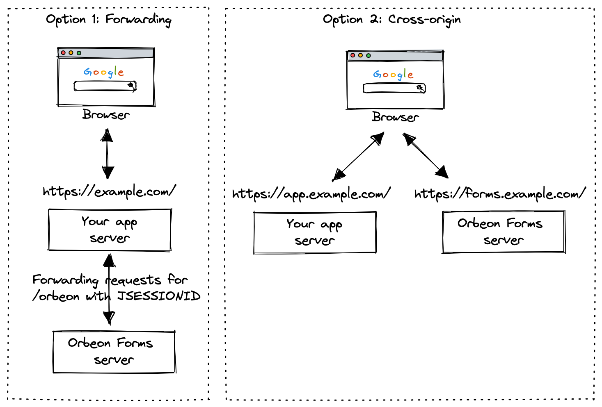

# Form Runner JavaScript Embedding API

## Availability

Since Orbeon Forms PE 2020.1. As of 2020.1, this feature is feature is experimental: the API is very much subject to change, and we're interested in your feedback so we can continue to improve this feature.

## Rationale

Server-side application using Java can use the 

## Usage

### Setup forwarding

If you're using the JavaScript embedding API, chances are that your application isn't running on Java. This means that Orbeon Forms won't be running on the same server and port as your application. Orbeon Forms will either run on a separate server, or, if on the same server, will do so on a separate port.

All the requests made by browser, whether for the page of your app that uses the embedding API or for Orbeon Forms resources, will made to your web server that runs your application, and it is your responsibility to setup that server so requests to Orbeon Forms are forwarded to the Orbeon Forms server, as shown in the diagram below.



#### Requests to forward

You can identify requests made to Orbeon Forms based on their path, which is typically `/orbeon`. (For Java web apps, that first part of the part is referred to as the "context", and should you want to, you can deploy Orbeon Forms on a different context, say `/forms`, but in what follows we'll just assume you've kept `/orbeon`.)

#### Forwarding the `JSESSIONID` cookie

When forwarding, you need to make sure the `JSESSIONID` cookie is properly forwarded. You can for instance check this with the Chrome Dev Tools using the Network tab. Make sure that:

1. The first time the browser makes a request to Orbeon Forms, that is with a path starting with `/orbeon`, the response will set `JSESSIONID` cookie.
2. In every subsequent request made to Orbeon Forms, that `JSESSIONID` cookie set earlier is sent by the browser, and the server doesn't in turn set another `JSESSIONID` in the response. (I.e. the value of `JSESSIONID` shouldn't change for the duration of the session.)

### Include Orbeon Forms' embedding JavaScript

In the page you want to embed a form from, include the following JavaScript by adding this element inside the page's `<head>`:

```html
<script 
    type="text/javascript" 
    src="/orbeon/xforms-server/baseline.js?updates=fr"></script>
````

### Call the Form Runner API 