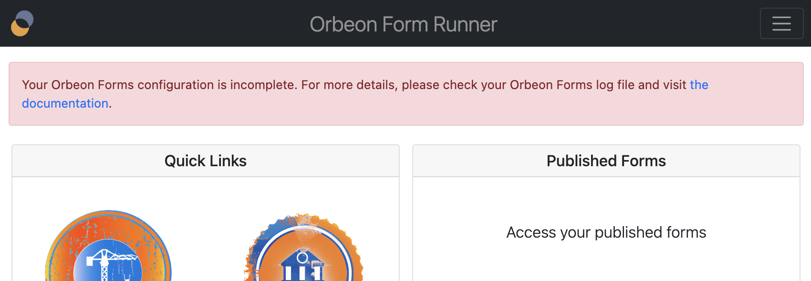

# Configuration banner

## Availability

[\[SINCE Orbeon Forms 2023.1\]](/release-notes/orbeon-forms-2023.1.md)

## Rationale

Orbeon Forms requires a few important configuration steps to be performed before it can be used, including:

- setting a password for encryption
- configuring a separate database

If either of these is not properly configured, Orbeon Forms show a banner at the top of application pages. 



You can learn more about the specific configurations that are missing by [configuring logging](/installation/logging.md) and checking the Orbeon Forms log file. The file will contain something like the following at the `ERROR` level:

```
The following Orbeon Forms configurations are incomplete:

- The password for the `oxf.crypto.password` property is missing or not strong enough.
- The password for the `oxf.fr.access-token.password` property is missing or not strong enough (optional).
- The password for the `oxf.fr.field-encryption.password` property is missing or not strong enough (optional).
- The database configuration is missing or incomplete.

Please visit this page for more: https://doc.orbeon.com/installation/configuration-banner
```

In addition, the following optional features require configuring separate passwords:

- [Token-based permissions](/form-runner/access-control/tokens.md)
- [Field-level encryption](/form-builder/field-level-encryption.md)

You do not have to configure these features if you do not plan to use them. However, the fact that these features are not configured will be logged at the `INFO` level.

The following subsections cover the individual configurations in more detail.

## Configurations

### Database

Out-of-the-box, Orbeon Forms includes an SQLite embedded database with multiple demo forms. This setup is designed for a quick start, but for development or production use, you should configure Orbeon Forms to use a separate [relational database](/form-runner/persistence/relational-db.md).

The reason for considering this an incomplete configuration is that the SQLite database is not suitable for production use with Orbeon Forms at this point. This is not necessarily due to shortcomings of SQLite, but due to the fact that the SQLite database is embedded in the Orbeon Forms WAR file and more likely to be deleted by mistake. In addition, most users want to use a more powerful database for production use.

You are not required to configure a separate database if you are using Orbeon Forms for evaluation purposes only, but in this case the configuration banner will show.

See also [Database setup](/installation/README.md#database-setup).

### Main encryption password

You must set the [`oxf.crypto.password`](/configuration/properties/general.md#oxfcryptopassword) property to something different from the default. This is used for the following:

- internal encryption (admin token, operations, internally-submitted data, uploaded URLs)
- product version in the URL
- `cid:` URLs and XML metadata format

This password is mostly used for transient data, but you must still change it.

### Access token password

If you plan to use [Token-based permissions](/form-runner/access-control/tokens.md), also set `oxf.fr.access-token.password`. If you don't set it and try to use access tokens, an error will be produced when the password is needed.

### Field-level encryption password

If you plan to use [Field-level encryption](/form-builder/field-level-encryption.md), also set `oxf.fr.field-encryption.password`. If you don't set it and try to use field-level encryption, an error will be produced when the password is needed.

## See also

- [Installation](/installation/README.md)
- [Logging](/installation/logging.md)
- [Properties](/configuration/properties/README.md)
- [Removing the built-in SQLite database](/configuration/advanced/production-war.md#removing-the-built-in-sqlite-database)